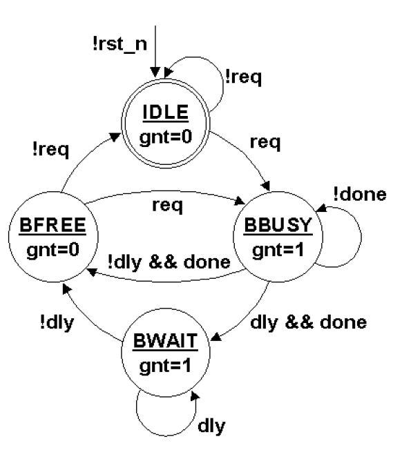

## Two Always Block FSM Style (Good Style)

Uno de los mejores estilos de codificación de Verilog es codificar el diseño FSM utilizando dos bloques always, uno par el registro de de estado secuencial y otro para el siguiente estado combinacional y la lógica de salida combinacional.

   
  <em> Figura 1: FSM 2 Bloques Always.</em>

